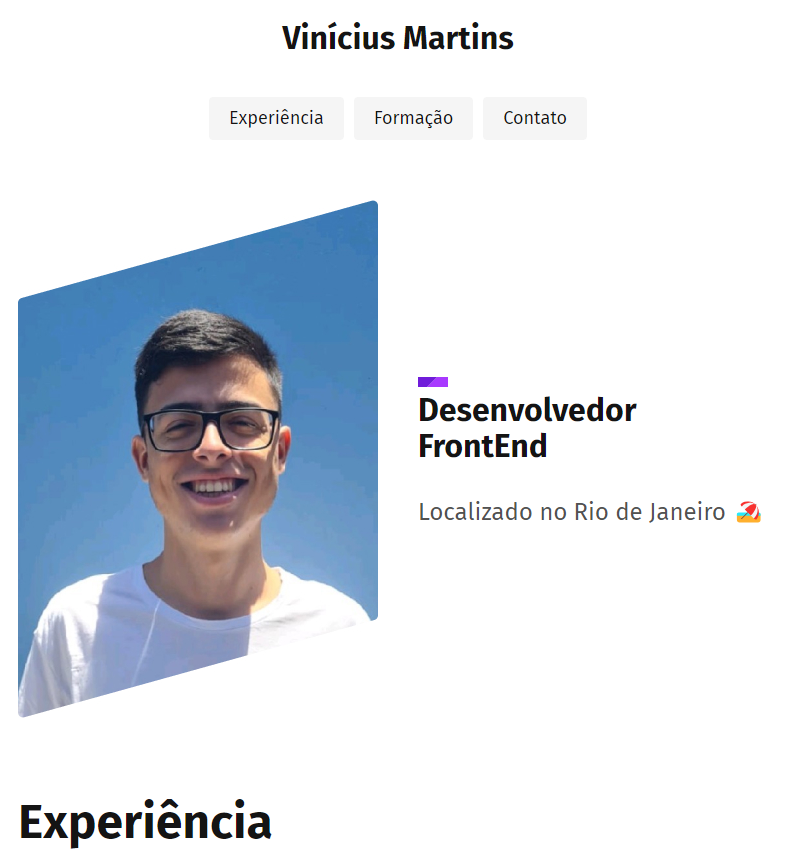

# Portfolio
Portfolio Vinícius Martins - Origamid

## Descrição
Projeto FrontEnd do curso [Origamid](https://www.origamid.com/). É um Portfolio inicial apenas com HTML e CSS
mostrando um pouco sobre experiências, formações e contatos.

## Aprendizagem
- HTML e CSS Básico;
- CSS Posicionamento;
- HTML e Semântica;
- CSS Propriedades;
- Responsivo;

## Tecnologias Utilizadas
- HTML;
- CSS;
- clean-css-cli (npm).

## Capturas de Tela
()
*Legenda: Screenshot da tela principal. Cabeçalho principal e menu de navegação no topo da imagem, um ao lado do outro. No meio da imagem, foto do desenvolvedor e a direita grande título com pequena descrição.*

 

*Legenda: Screenshot da tela principal. Cabeçalho principal e menu de navegação no topo da imagem, um abaixo do outro. No meio da imagem, foto do desenvolvedor e a direita grande título com pequena descrição.*

## Links
[Solução](https://viniciussnitram.github.io/portfolio/)
[LinkedIn](https://linkedin.com/in/viniciussmartins)